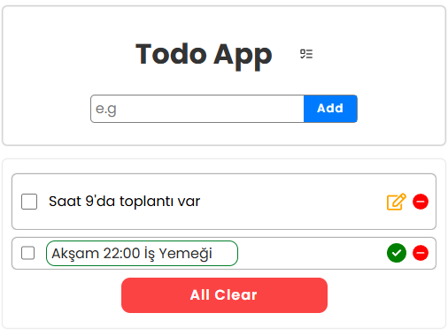

# React Todo App (Redux + Vite)

Bu proje, modern web teknolojileri kullanılarak geliştirilmiş, şık ve işlevsel bir Todo (Yapılacaklar) uygulamasıdır. Kullanıcıların görev eklemesine, düzenlemesine, tamamlamasına ve silmesine olanak tanır. Veriler yerel depolamada (LocalStorage) saklanır.
## Özellikler
- Todo ekleme
- Todo silme
- Todo tamamlandı durumu toggle
- Todo düzenleme (edit)
- LocalStorage ile verilerin kalıcı olması
- Basit uyarılar (`alert`)
- Responsive ve minimal CSS ile tasarım

## Kullanılan Teknolojiler

Projede aşağıdaki teknolojiler ve sürümleri kullanılmıştır:

- **React 19**: Kullanıcı arayüzü bileşen tabanlı yapı.
- **Vite 8**: Hızlı geliştirme ortamı ve yapılandırma.
- **Redux Toolkit 2.11**: Global state (durum) yönetimi.
- **React Icons 5.6**: Icon kullanımı için.

## Kurulum ve Çalıştırma

Projeyi yerel makinenizde çalıştırmak için şu adımları izleyin:

1. Bağımlılıkları yükleyin:
   ```bash
   npm install
   ```

2. Geliştirme sunucusunu başlatın:
   ```bash
   npm run dev
   ```

3. Tarayıcınızda `http://localhost:5173` adresine gidin.

##  Önizleme



##  Mevcut Durum

Uygulama tam fonksiyonel olarak çalışmaktadır:
- Görev ekleme, silme ve düzenleme yapılabilir.
- Görevler "tamamlandı" olarak işaretlenebilir.
- Sayfa yenilense bile veriler kaybolmaz (LocalStorage entegrasyonu).
